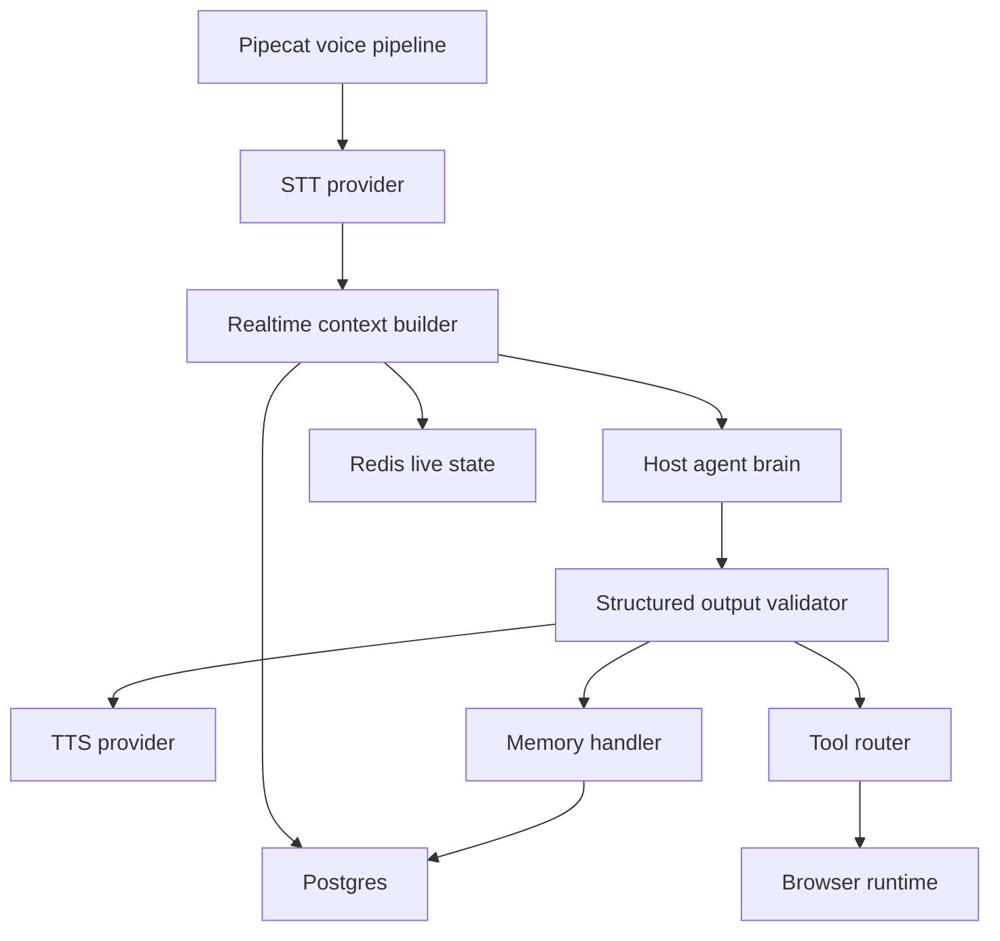
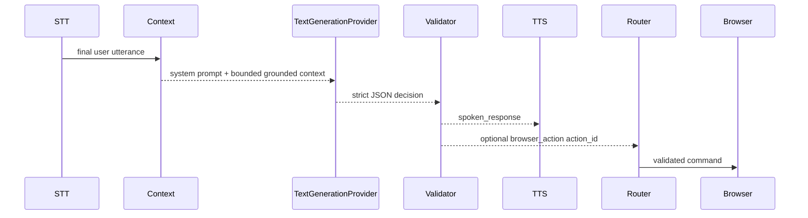
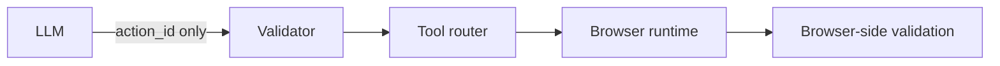
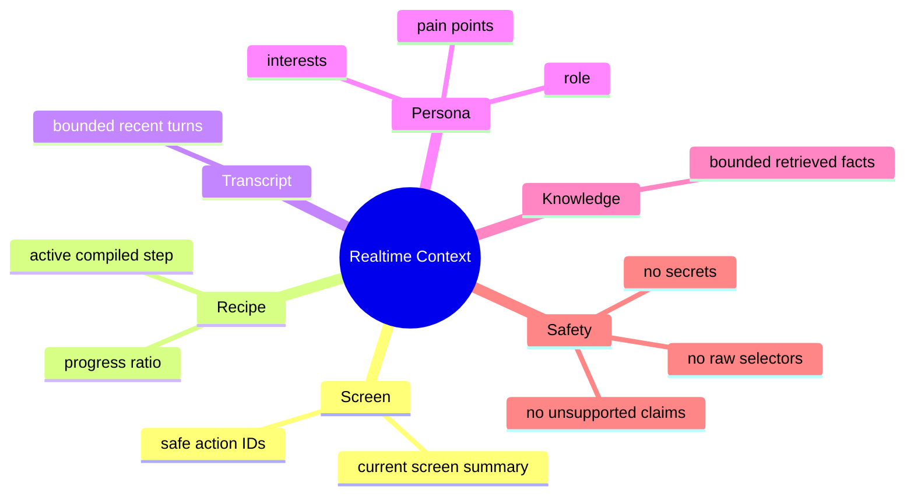

# Agent Runtime Service

`services/agent_runtime` owns the realtime voice loop and agent brain. It receives final transcripts, builds compact context, calls provider-agnostic LLM interfaces, validates structured decisions, streams TTS, routes safe browser actions, and records transcript/memory events.

## Runtime Boundary



## Agent Decision Flow



The agent runtime does not contain provider-specific business logic. It uses shared provider abstractions from `packages/backend_common`.

## Browser Authority Rule



The LLM cannot output selectors, JavaScript, cookies, credentials, or unbounded browser commands.

## Context Sources



## Verification

```bash
make agent-test
make agent-brain-test
```
