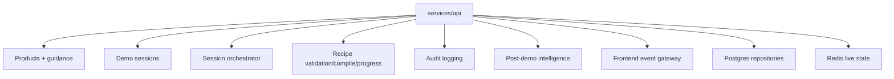
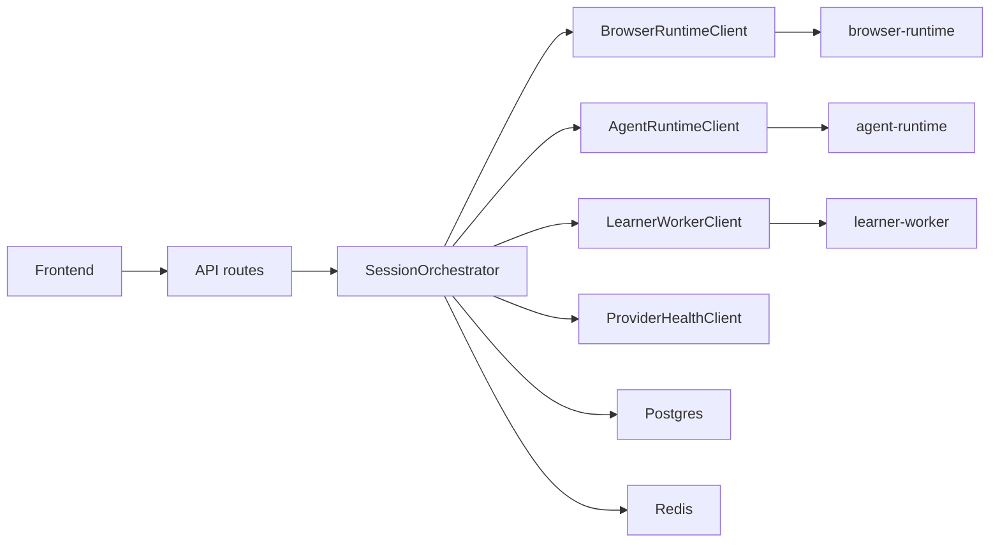
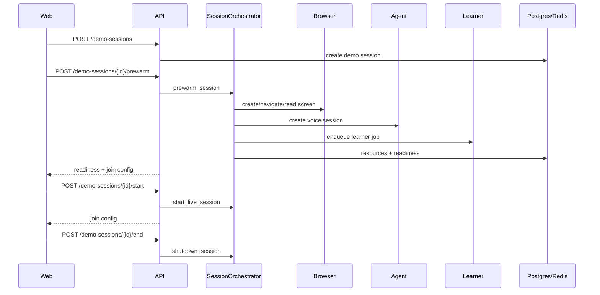
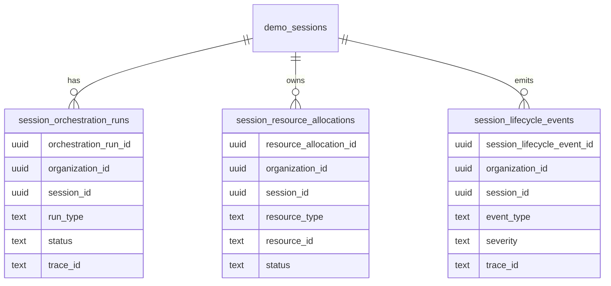
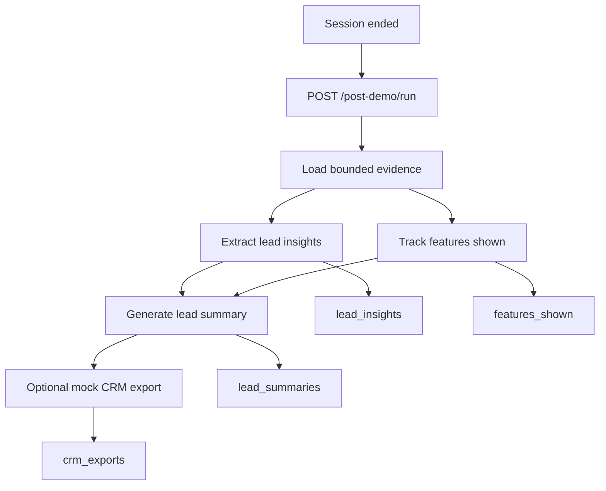
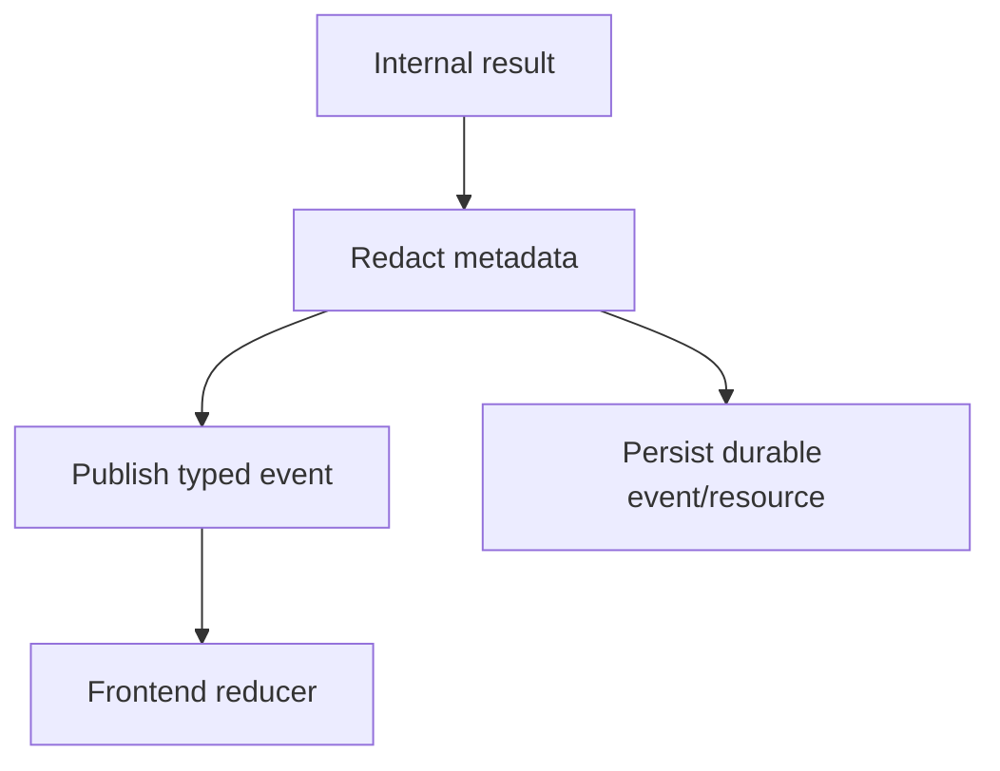

# API Service

`services/api` is the backend control plane. It owns product/session APIs, session orchestration, recipe APIs, post-demo intelligence, persistence-facing repositories, event publishing, audit integration, and frontend-safe join/readiness state.

It does not run Playwright directly, run the Pipecat pipeline directly, or execute LLM decisions directly.

## Ownership



## Orchestration Boundary



The orchestrator coordinates services through internal clients. It records resources durably and never reaches into runtime internals.

## Main API Session Flow



## Durable Tables Added For Orchestration



## Key Modules

| Module | Purpose |
| --- | --- |
| `orchestration/session_orchestrator.py` | Main prewarm/start/recover/shutdown coordinator |
| `orchestration/readiness.py` | Deterministic readiness scoring |
| `orchestration/resource_registry.py` | Durable resource allocation state |
| `orchestration/orchestration_locks.py` | Redis owner locks with safe release |
| `orchestration/idempotency.py` | Duplicate operation protection |
| `orchestration/browser_agent_sync.py` | Speech/action/screen sync state |
| `clients/*_client.py` | Bounded internal service clients |
| `repositories/session_*` | Phase 12 durable state repositories |
| `post_demo/*` | Phase 13 evidence-backed insight, summary, and CRM export modules |

## Post-Demo Intelligence Boundary



The post-demo path is cold-path only. It validates evidence IDs, redacts text before summaries and CRM payloads, and defaults CRM export to the mock dry-run adapter.

## State And Event Safety



Events must not include provider secrets, raw prompts, raw audio, screenshots/base64, cookies, or tokens.

## Verification

```bash
make orchestration-test
make orchestration-test-integration
make orchestration-smoke
make post-demo-test
make post-demo-test-integration
```
