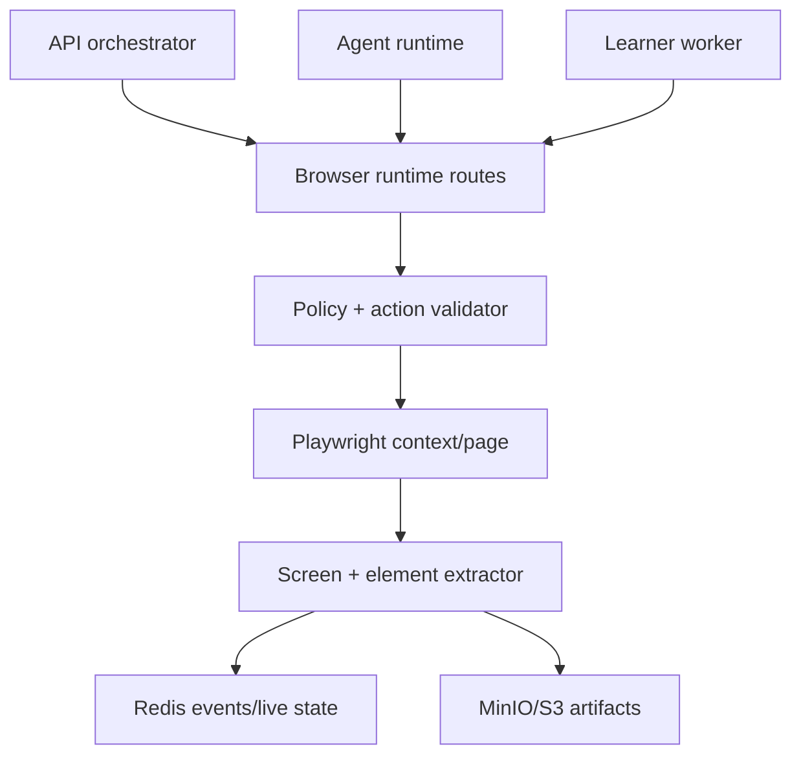
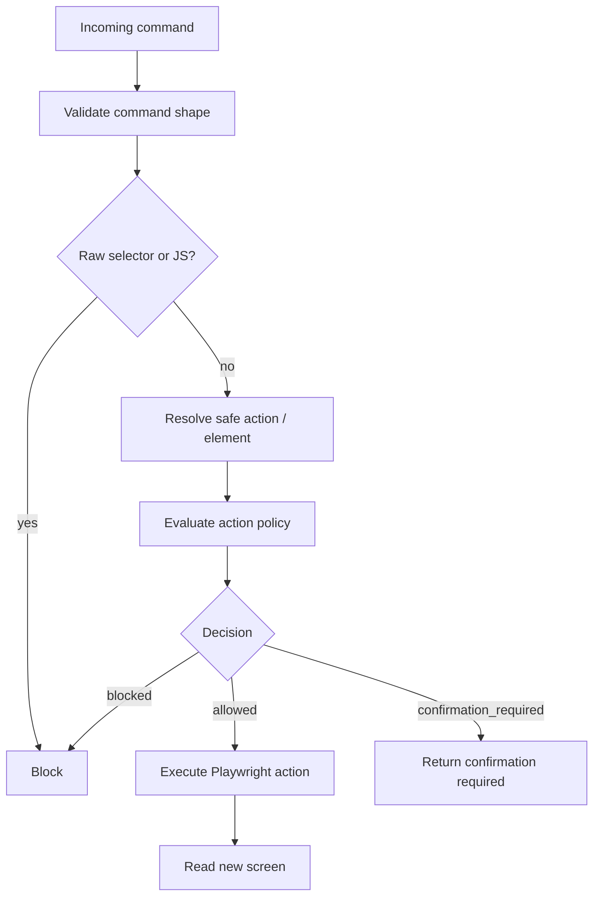
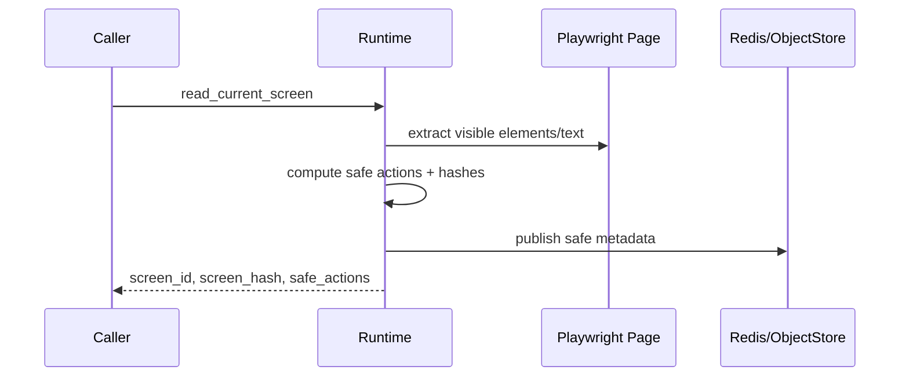

# Browser Runtime Service

`services/browser_runtime` owns browser automation and is the final execution authority for browser commands. It exposes screen state, safe actions, cursor events, screenshots/artifacts metadata, and validated browser actions.

The service is TypeScript-based and uses Playwright internally.

## Execution Boundary



## Browser Command Safety



The browser runtime revalidates even when the API or agent already validated an action.

## Screen State Flow



No raw screenshots/base64, cookies, localStorage, sessionStorage, or secrets should be placed into prompts or frontend-visible events.

## Verification

```bash
make browser-test
make browser-test-integration
pnpm --filter @live-demo-agent/browser-runtime test -- policy
```

