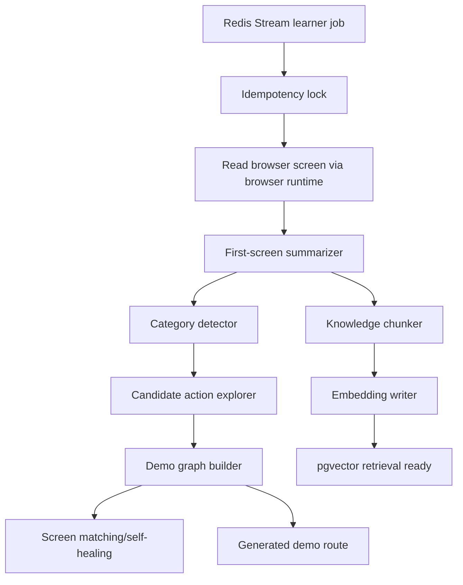
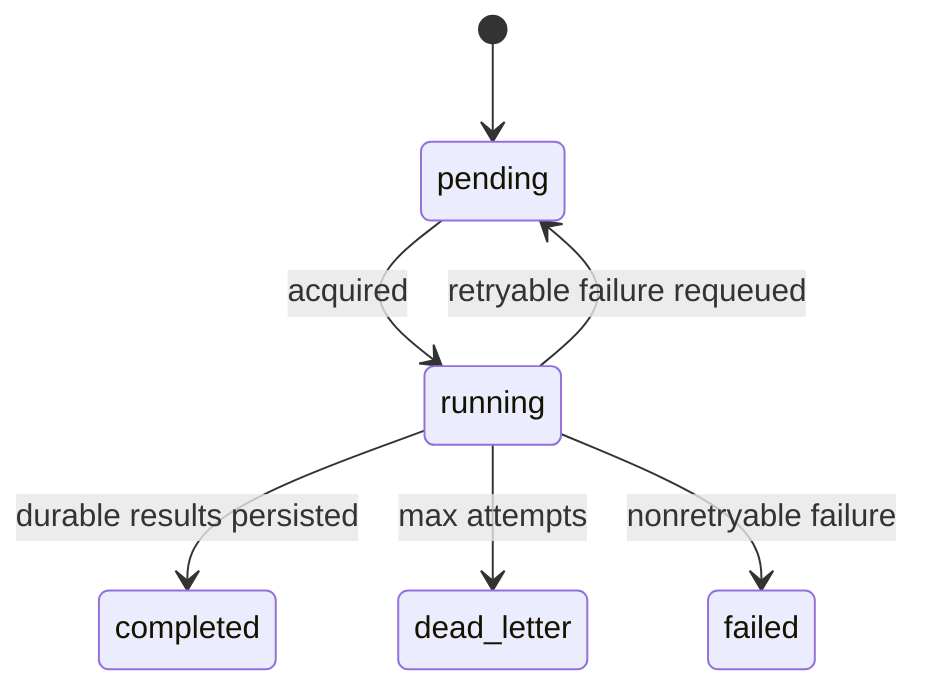
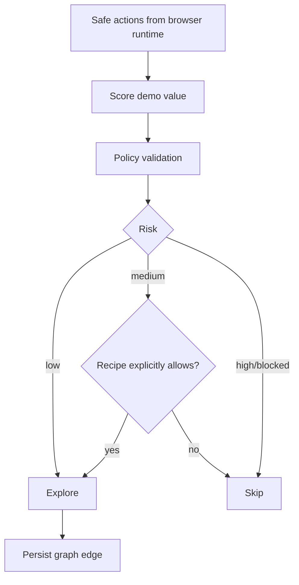
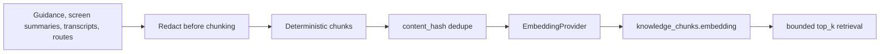

# Learner Worker

`services/learner_worker` is the cold-path product learner. It learns product basics asynchronously after a URL or session is created. It enriches future demos through summaries, category detection, safe exploration, demo graph updates, generated routes, knowledge chunks, embeddings, and retrieval.

It must never block first audio or live agent response.

## Cold-Path Pipeline



## Job Lifecycle



Jobs are idempotent, restart-safe, tenant-scoped, and bounded by max attempts.

## Exploration Safety



Default exploration does not submit forms, type text, click destructive actions, or navigate outside allowed domains.

## Knowledge Flow



## Verification

```bash
make learner-test
make learner-test-integration
```

