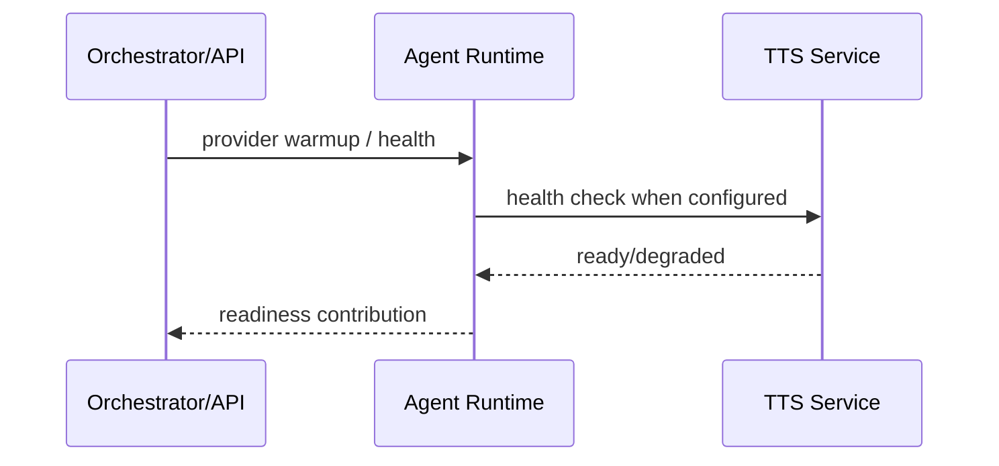

# TTS Service

`services/tts_service` is the optional text-to-speech service boundary. The primary realtime voice pipeline lives in `services/agent_runtime`, but this package keeps TTS health and provider-facing service concerns isolated for local and future deployment modes.

## Boundary


## Health Role



TTS warmup is bounded and should not block prewarm unless the deployment explicitly requires it.

## Verification

```bash
uv run pytest services/tts_service/tests
```

