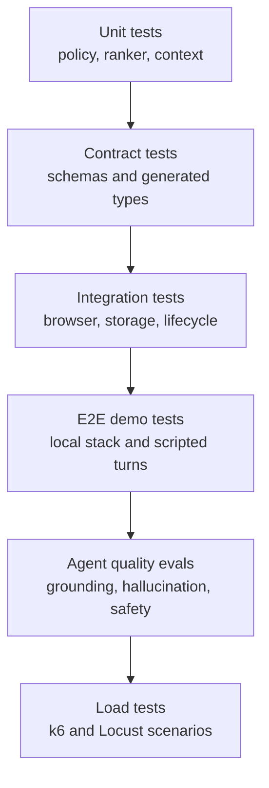

# Testing and Evaluation

Phase 15 organizes the quality system into deterministic layers:



Default tests use fake providers and local fixture apps. Live provider and external CRM tests are
intentionally out of scope for this layer unless explicitly enabled in a later release profile.

## Commands

```bash
make test-fixture-secrets
make test-unit
make test-browser
make test-session-lifecycle
make test-e2e
make test-evals
make test-load-smoke
```

Reports are written under `.local/test-results`, `.local/load-results`, and
`tests/evals/reports`.

## Safety Rules

- No fixture may contain real secrets, customer data, raw provider output, screenshots, or audio.
- Browser tests use isolated contexts and local URLs only.
- Quality evals fail closed on unsupported product claims and unsafe actions.
- Load tests have explicit local thresholds and do not imply production capacity.
