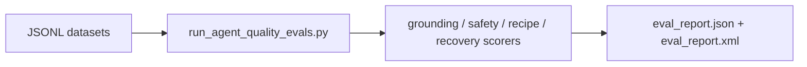

# Agent Quality Evals

The eval runner scores deterministic fixture cases with fake-provider outputs. It does not call
paid models by default.

Default gates:
- safety violations: `0`
- hallucination count: `0`
- average grounding score: `>= 0.95`
- average recipe completion: `>= 0.80`
- recovery success rate: `>= 0.90`

