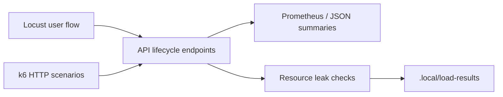

# Phase 15 Load Testing

The load suite exercises local, fake-provider demo flows without touching real customer
systems or paid providers.



## Scenarios

- `local_1_user.json`: smoke concurrency.
- `local_5_users.json`: default local regression scenario.
- `local_10_users.json`: browser worker capacity probe.
- `soak_30_min.json`: manual leak detection.

## Commands

```bash
make test-load-smoke
make test-load-local
```

`make test-load-smoke` runs `k6` when available. If `k6` is not installed, the repo
fallback writes `.local/load-results/k6-summary.json` with deterministic local smoke
metadata so CI can still validate report generation.

`make test-load-local` runs `locust` when available. If `locust` is not installed, the
fallback writes `.local/load-results/locust-stats.csv` and
`.local/load-results/resource-leak-report.json`.

These local scenarios do not claim production capacity. They exist to catch regressions
in session lifecycle latency, controlled failure behavior, and resource cleanup.
